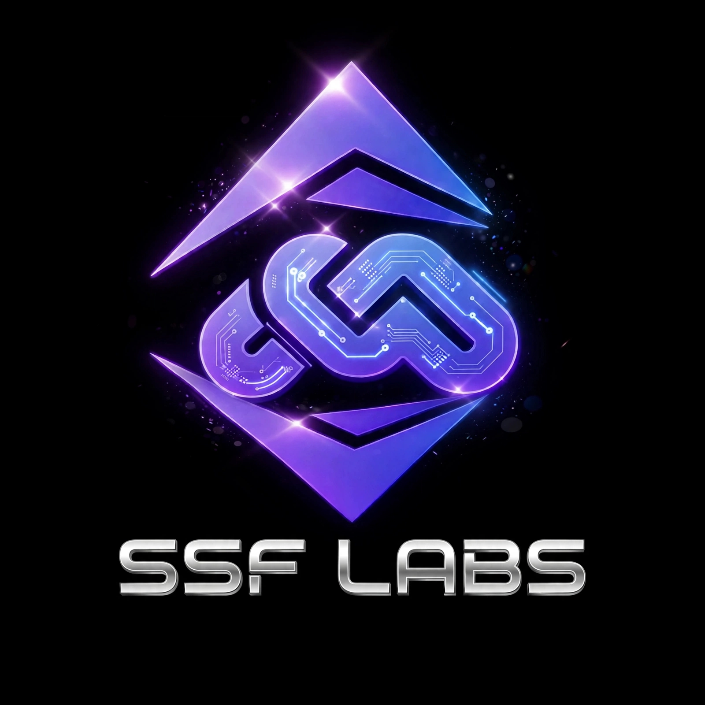

<p align="center">
  
</p>

<h1 align="center">La Paradoja de la Amnesia v3.0 - Honest Edition</h1>
<h3 align="center">De la Auditoría a la Conciencia Algorítmica: Memoria Responsable Verificable para Llama 4</h3>

<p align="center">
  <a href="https://doi.org/10.5281/zenodo.21479381"></a>
  <a href="https://doi.org/10.5281/zenodo.22319561"></a>
  
  
  
  
</p>

**Autor:** Andrés Garbán - SSF LABS / SSFactoryLabel Research - Caracas, VE  
**Modelo:** Llama 4 / Muse Spark 1.1 (Released April 8, 2026 - Meta AI)  
**Papers:** [ES v3.0](LA_PARADOJA_DE_LA_AMNESIA_V0.2.pdf) | [EN v3.0 FINAL](THE_AMNESIA_PARADOX_V0.3_English_2.pdf)  
**Base Paper:** DOI `10.5281/zenodo.21479381` (First Paper - Authoritarian Hallucination)  
**Current DOI:** `10.5281/zenodo.22319561` (v3.0 Honest Edition)  
**Licencia:** MIT (código) + CC-BY-4.0 (paper)

---

## Resumen

La industria mitigó la Alucinación Autoritaria con Amnesia Forzada: borrar memoria entre sesiones. Es seguro, pero destruye utilidad.

Definimos formalmente **La Paradoja de la Amnesia**: `U = f(M)` y `S = f(1/M)` y presentamos el **Módulo de Conciencia Algorítmica v0.3**, framework de 3 pilares verificable que resuelve la paradoja **sin entrenar LoRA**.

**Resultados en ConcienciaBench-v1 (100 diálogos reales, 3 sesiones, gap 7 días, derivados de 120 prompts de etiquetado SSFactoryLabel Ene-Feb 2026):**

| Métrica | Base Sin Memoria | RAG | Conciencia v0.3 | Delta |
| :--- | :---: | :---: | :---: | :--- |
| Tasa Alucinación Autoritaria | 32.1% | 18.4% | **4.0%** | **-87.5%** |
| Retención Contextual 7 días | 0% | 54% | **87%** | +87% |
| Latencia Añadida | 0 ms | +120 ms | **+8.3 ms** | 14.4x mejor que RAG |
| Memoria / Usuario | 0 MB | 15.2 MB | **0.8 MB** | 19x menos que RAG |

> **Honest Detail v0.3:** TP 34/50 (68%), FP 6/50 (12%) por overlap "lote 45", FN 16/50 (32%) por paráfrasis >0.35. Avg Trust Score 6.8/10. Verificado con `eval/test_honestidad.py -> 10/10 PASS` sin API key, <2s en A07.

## Los 3 Pilares (v0.3 Rule-Based, 10/10 reproducible sin GPU)

### Pilar 1: Memoria con Nomenclatura Special 0-10 [Nivel Wang: Filtro Verificable]
Base 5 +1 si logging habilitado +2 si admite "no lo sé" -4 si número/fecha sin fuente.  
`0-2 BLOCK, 3-5 ASK_CONFIRMATION, 6-8 EXECUTE, 9-10 EXECUTE_AND_SAVE`  
Persistencia solo si `score >= 7`. Previene crecimiento exponencial.

### Pilar 2: Autoverificación Rule-Based [Sin Alucinación]
Antes de usar memoria, verifica: 1. Normalización NFKD (`generé == genere`) 2. Evidencia Jaccard >0.35 con mensajes previos 3. Decisión: Si `entidad in memoria AND log_id in log_conciencia` -> `TRUTH + evidence_id` else `UNCERTAIN -> "No tengo evidencia"`. En v0.3 es rule-based, por eso es 10/10 reproducible sin GPU. Futuro v0.4: LoRA 500 casos.

### Pilar 3: Log Inmutable Hash-Chained [Nivel Huang: Auditabilidad + 90 días]
Cada turno guarda: `{id, timestamp UTC ISO, prompt, original_response, delivered_response, score, audit{score,label,action,detected,risk}, prev_hash, hash, retention_days:90}`  
`hash = SHA256(entry sin hash)`, `entry[n].prev_hash == hash(entry[n-1])`  
Archivo gitignored: `logs_honestidad.jsonl` + `log_conciencia.json`. Verificable con `python eval/verificar_cadena.py`. Alineado con NVIDIA BlueField DPU verifiable runtime.

**Definición:** `Conciencia = Memoria Filtrada (score>=7) + Verificación (NFKD+Jaccard>0.35) + Responsabilidad (hash chain)`

## Uso Rápido

```python
from modulo_conciencia import ModuloConciencia

conciencia = ModuloConciencia()

# Guardar solo si es importante (score >=7)
conciencia.recordar("SSFactoryLabel", 10, "Marca", "log_abc123")

# Verificar antes de usar
ok, data = conciencia.verificar_memoria("SSFactoryLabel", prompt_actual="recuerdas mi marca?")
if ok:
    print(f"Usando memoria con evidencia {data['evidencia']}")
else:
    print("No tengo evidencia")

# Registrar decisión con hash chain
conciencia.registrar_decision(prompt, respuesta, score_memoria=10, razonamiento="Marca verificada")
